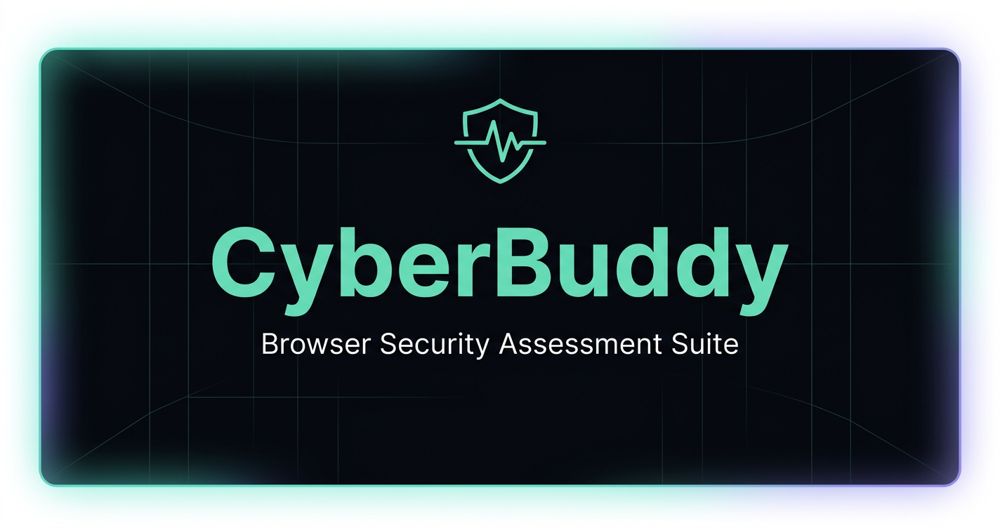

# CyberBuddy

[](https://github.com/AmitPal-CyberBuddy/CyberBuddy/actions/workflows/ci.yml)
[](https://github.com/AmitPal-CyberBuddy/CyberBuddy/actions/workflows/pages.yml)
[](LICENSE)
[](https://www.python.org/)

**Seven browser-security checks in one console — clickjacking, security
headers, CSP, CORS, DNS posture, CSRF proof-of-concepts and JWTs — with
screenshot-ready evidence for every result.**

### [Launch CyberBuddy](https://amitpal-cyberbuddy.github.io/CyberBuddy/)

[Tools](https://amitpal-cyberbuddy.github.io/CyberBuddy/tools/) ·
[Guides](https://amitpal-cyberbuddy.github.io/CyberBuddy/guides/) ·
[Documentation](https://amitpal-cyberbuddy.github.io/CyberBuddy/documentation/) ·
[Methodology](https://amitpal-cyberbuddy.github.io/CyberBuddy/methodology/)

No install, no signup, no account. Open the site, paste a target, read the
report. Everything below is also runnable on your own machine, where the same
graders run with a local Python engine behind them.

---

## What you get

- **A verdict you can defend.** Every finding shows the raw header, record or
  policy it came from, plus a provenance strip naming the tool, the engine and
  the time — so a cropped screenshot is still self-identifying.
- **Evidence, not just a score.** Print/PDF, PNG evidence card, Markdown, JSON,
  CSV and a standalone HTML report, one click each.
- **Honest labels.** Results are marked LIVE or CACHED, verified or unverified,
  and analyst-attested answers are never presented as measured ones.
- **Nothing to trust blindly.** No third-party JavaScript, no analytics, no
  accounts, no build step. Scan history stays in your browser.

## The tools

| Tool | What it tells you |
| --- | --- |
| **Clickjacking Validator** | Whether a page can be framed — a live iframe test with a red click-target overlay, scored against `X-Frame-Options` and CSP `frame-ancestors` |
| **Security Headers** | A 0–100 score and A–F grade across CSP, HSTS, XFO, nosniff, Referrer-Policy, Permissions-Policy, COOP/COEP/CORP and cookie flags |
| **CSP Policy Auditor** | What a Content-Security-Policy actually blocks — effective script/style sources, enforced vs Report-Only, object/base/framing/form controls, mixed content, Trusted Types and reporting |
| **CORS Validator** | Whether an API leaks authenticated responses cross-origin — two-origin probe with reflected/`null` origins, credentials, `Vary: Origin` and a per-method coverage matrix |
| **DNS & Domain Security Analyzer** | A domain's public-DNS posture graded 0–100 — SPF, DMARC, DKIM, DNSSEC, CAA, MX and name-server redundancy, with the raw record behind each finding |
| **CSRF PoC Generator** | Paste a raw Burp request, get a standalone HTML proof-of-concept, each variant labelled READY, LIMITED or NOT DIRECTLY REPRESENTABLE |
| **JWT Security Workbench** | Decode, verify, edit and re-sign tokens; prioritized VAPT test payloads with Burp steps; test-variant templates and bounded HMAC secret testing |

The first five take a URL or domain. The last two never touch the network —
they run entirely in your browser tab.

## Guides

One short, tool-connected note per tool: what the weakness is, how to confirm
it with the matching tool, and the primary references for depth.

| Guide | Standards |
| --- | --- |
| [Clickjacking](https://amitpal-cyberbuddy.github.io/CyberBuddy/guides/clickjacking/) | OWASP WSTG-CLNT-09 · CWE-1021 |
| [Security Headers](https://amitpal-cyberbuddy.github.io/CyberBuddy/guides/headers/) | OWASP WSTG-CONF-07 · CWE-693 |
| [CSP](https://amitpal-cyberbuddy.github.io/CyberBuddy/guides/csp/) | OWASP WSTG-CONF-12 · CWE-79 |
| [CORS](https://amitpal-cyberbuddy.github.io/CyberBuddy/guides/cors/) | OWASP WSTG-CLNT-07 · CWE-942 |
| [DNS](https://amitpal-cyberbuddy.github.io/CyberBuddy/guides/dns/) | RFC 7489 · RFC 7208 · RFC 6376 · RFC 4033 · CWE-290 |
| [CSRF](https://amitpal-cyberbuddy.github.io/CyberBuddy/guides/csrf/) | OWASP WSTG-SESS-05 · CWE-352 |
| [JWT](https://amitpal-cyberbuddy.github.io/CyberBuddy/guides/jwt/) | RFC 7519 · RFC 7515 · OWASP WSTG-SESS-10 · CWE-347 |

Scoring rules are on the
[methodology page](https://amitpal-cyberbuddy.github.io/CyberBuddy/methodology/).

## Authorized testing only

Assess only systems you own or have written permission to test.

Network checks are non-destructive. HTTP assessment uses a GET baseline plus
analyst-selected HEAD/OPTIONS requests and a CORS preflight simulation;
CyberBuddy never sends POST, PUT, PATCH, or DELETE to a target. DNS analysis
reads public records through a resolver and never connects to the target's own
servers. CSRF and JWT artifacts are generated locally and are never executed
for you.

## Run it locally

The hosted site is fully usable, but browsers cannot read cross-origin response
headers. Running the local server puts a real Python engine behind the header,
CSP and CORS tools, so any target gets full-strength results with no relay
involved.

Requires **Python 3.10+** and nothing else — no pip install, no Node, no build.

```bash
git clone https://github.com/AmitPal-CyberBuddy/CyberBuddy.git
cd CyberBuddy
python3 server.py
# open http://127.0.0.1:8080/
```

It binds loopback only. Cloud-metadata and link-local targets are always
rejected; private-network targets are allowed on a loopback bind, and need an
explicit opt-in otherwise:

```bash
python3 server.py --host 0.0.0.0 --allow-private
```

Each engine is also a standalone CLI with `--json` output and an exit code of
`1` when a target scores high risk, which makes them easy to drop into CI:

```bash
python3 security_headers.py https://example.com
python3 csp_checker.py -f urls.txt --json
python3 cors_validator.py https://example.com/api
python3 clickjacking_validator.py https://example.com
python3 dns_security.py example.com
```

Full operator reference — engine selection, every CLI flag, export formats and
the limits of the hosted build — is on the
[documentation page](https://amitpal-cyberbuddy.github.io/CyberBuddy/documentation/).

## Privacy

- **Your scan history never leaves your browser.** Recent targets and a
  10-minute header cache live in `localStorage`, expire after 24 hours, and are
  never uploaded. *Clear* wipes both.
- **Third-party relays are opt-in.** With no Python engine available, the
  hosted site has to proxy a header read, which discloses the target to the
  relay operator. CyberBuddy asks first, sends only the hostname by default —
  not the path or query, where tokens live — and flags relayed findings
  *unverified* in the UI and in every export.
- **The demo cache is not user data.** Published reports are built in CI from a
  fixed demo list. Nothing a visitor types is written there.
- **The local-only tools mean it.** No token, key, secret, wordlist or pasted
  request from the CSRF and JWT tools is ever sent, stored or put in the URL.

## How it's built

Static HTML, CSS and vanilla JavaScript on the front end; Python standard
library on the back end. No framework, no bundler, no third-party packages,
no external JavaScript at runtime.

Each grader is implemented twice — once in Python for the server and CLIs, once
in the browser so the hosted site can score without a server — and both are
pinned to shared fixture files, so a target cannot get a different result
depending on where it was scanned. A scan is answered by the first source
available: the local Python engine, then an optional hosted API, then a
published report for demo targets, then the in-browser grader.

Because GitHub Pages cannot send response headers, the hosted site ships its
policy as a meta CSP and cannot set `frame-ancestors`, `X-Frame-Options` or
HSTS — so it will not score A against itself even though `server.py` does.
That is a hosting limit, not a scoring bug.

## Contributing and security

Contributions are welcome — start with [the contributing guide](CONTRIBUTING.md)
and the [code of conduct](CODE_OF_CONDUCT.md). Run the full release gate before
opening a pull request (needs Git, Python 3.10+ and Node.js; CI uses Node 20):

```bash
python3 tools/verify.py
```

Please report vulnerabilities in CyberBuddy itself privately per the
[security policy](SECURITY.md) rather than in a public issue. Never attach live
tokens, credentials, private target URLs or customer data to an issue or pull
request.

## License

[Apache-2.0](LICENSE) © 2026 Amit Pal. Permissive, with an explicit patent
grant — use, modify and redistribute it, including commercially, as long as you
keep the notice and state your changes.

## Contact

Ideas, feedback or collaboration: **amitpal.secure@gmail.com** ·
[LinkedIn](https://www.linkedin.com/in/amitpal-wb/) ·
[Medium — security write-ups](https://amitpxl.medium.com/)
